## Introducción
---

La pandemia de COVID-19 tuvo un impacto profundo y multifacético en todo el mundo, y los países de Latinoamérica no fueron la excepción. Esta región, caracterizada por su diversidad demográfica, socioeconómica y de infraestructura de salud, experimentó una variedad de respuestas y resultados ante la crisis sanitaria. El presente estudio se centra en analizar y comprender cómo el COVID-19 afectó a diferentes países de Latinoamérica, proporcionando una visión integral basada en datos.

## Metodología de trabajo
---

Para analizar el impacto del COVID-19 en los países de Latinoamérica, seguimos una metodología estructurada que incluye las siguientes etapas:

- Extracción de Datos: Recopilamos datos de fuentes confiables sobre casos confirmados, fallecimientos, vacunación, indicadores socioeconómicos y demográficos de los países de la región.

- Transformación de Datos: Realizamos la limpieza, normalización y estandarización de los datos, asegurando su consistencia y calidad. Convertimos tipos de datos, homogenizamos unidades de medida y corregimos errores.

- Identificación de Anomalías: Detectamos y corregimos outliers, validamos los datos con fuentes adicionales y ajustamos inconsistencias para asegurar la veracidad de la información.

- Preparación del Conjunto de Datos: Integramos datos de diversas fuentes en un único conjunto estructurado. Creamos variables derivadas y normalizamos los datos para un análisis comparativo justo.

- Análisis Exploratorio de Datos (EDA): Utilizamos visualizaciones, estadísticas descriptivas y análisis de correlación para descubrir patrones, tendencias y relaciones clave en los datos.

- Interpretación y Conclusiones: Interpretamos los resultados del EDA para extraer conclusiones significativas sobre el impacto del COVID-19 en la región, proporcionando insights valiosos para mejorar la respuesta ante futuras pandemias.

## Análisis Exploratorio de Datos
---

### Matriz de Correlación de Variables Numéricas Relacionadas con el Impacto del COVID-19 en Latinoamérica"

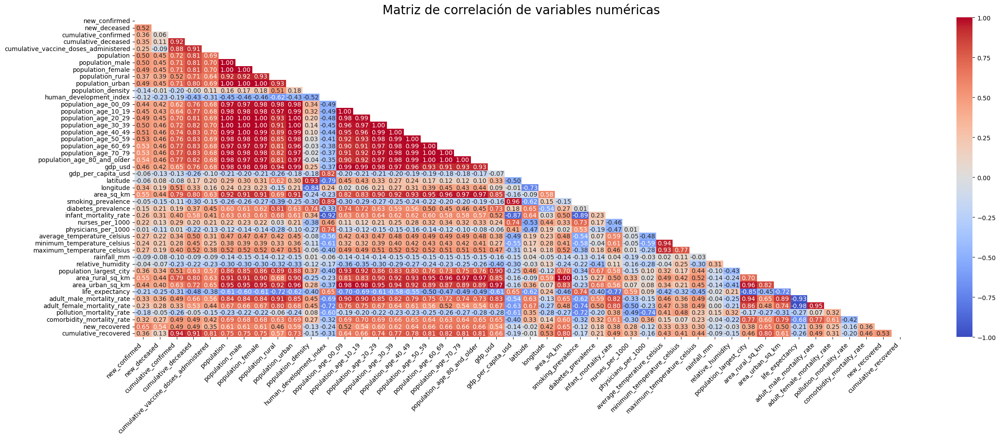

La matriz de correlación revela relaciones significativas entre diversos factores del COVID-19 en Latinoamérica, destacando:

1. Mortalidad por género:
La mortalidad masculina por COVID-19 es mayor en todas las franjas etarias, evidenciando una mayor vulnerabilidad del género masculino.

2. Comorbilidad y mortalidad:
Se observa una alta correlación entre la presencia de comorbilidades y la tasa de mortalidad por COVID-19, tanto en hombres como en mujeres.

3. Vacunación y casos confirmados:
Existe una correlación negativa entre la tasa de vacunación y el número de casos confirmados, indicando que la vacunación reduce la probabilidad de contraer el virus.

4. Densidad poblacional y casos confirmados:
Se observa una correlación positiva entre la densidad poblacional y el número de casos confirmados, sugiriendo que la concentración de personas facilita la transmisión del virus.

5. PIB per cápita y casos confirmados:
La correlación entre PIB per cápita y casos confirmados es insignificante, indicando que el nivel de ingresos no tiene un impacto determinante en la cantidad de casos.

6. PIB per cápita y muertes:
Se observa una correlación negativa entre PIB per cápita y muertes por COVID-19, sugiriendo que los países con mayor ingreso tienen mejores recursos para enfrentar la pandemia y reducir la mortalidad.

En general, la matriz de correlación proporciona información valiosa sobre las relaciones entre diversos factores del COVID-19 en Latinoamérica.

Es importante destacar que estas correlaciones no implican necesariamente relaciones causales, y se requiere un análisis más profundo para comprender los mecanismos subyacentes.

### Total de Casos Confirmados de COVID-19 Acumulados por País en Latinoamérica

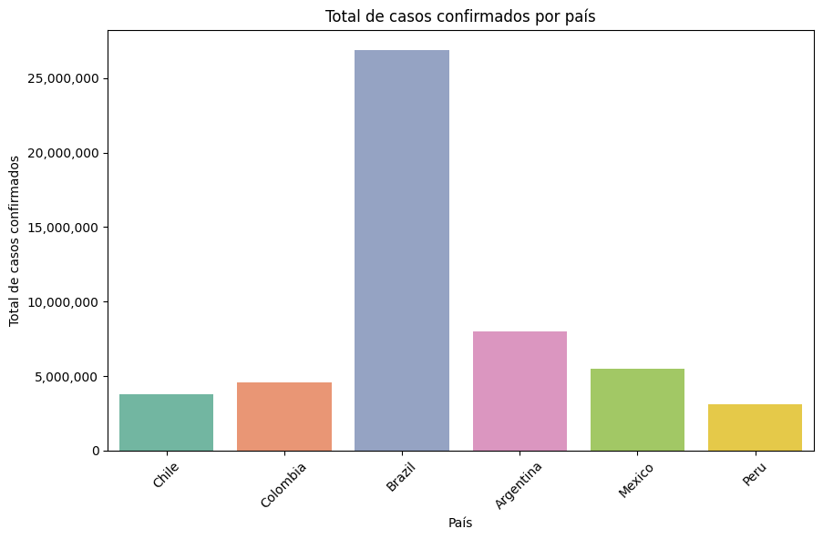

El gráfico muestra una distribución desigual de casos confirmados de COVID-19 en los países latinoamericanos analizados, con Brasil a la cabeza.

Brasil presenta la mayor cantidad de casos confirmados, seguido de Argentina, Colombia, Chile, México y Perú.

La diferencia en el número de casos confirmados entre los países podría atribuirse a diversos factores, como:

Tamaño de la población: Brasil tiene la población más grande de los países analizados, lo que aumenta su probabilidad de tener un mayor número de casos.
Densidad poblacional: Brasil también tiene una de las densidades de población más altas de la región, lo que facilita la transmisión del virus.
Medidas de control: La implementación y efectividad de las medidas de control de la pandemia, como el distanciamiento social, el uso de máscaras y las campañas de vacunación, podrían haber variado entre los países.
Capacidad de testeo: La disponibilidad y accesibilidad de las pruebas de COVID-19 podrían haber influido en el número de casos confirmados en cada país.
Es importante destacar que el número de casos confirmados no refleja necesariamente la prevalencia real del virus en cada país, ya que los criterios de testeo y la tasa de asintomáticos pueden variar.

Sin embargo, el gráfico proporciona una visión general del impacto del COVID-19 en los países latinoamericanos y permite identificar áreas de mayor riesgo y necesidad de intervención.

### Análisis Comparativo de la Relación entre la Temperatura Promedio y Nuevos Casos Confirmados y Decesos por COVID-19 en Países de Latinoamérica

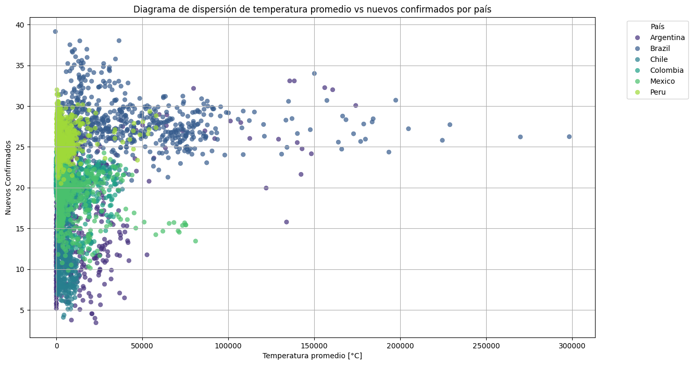

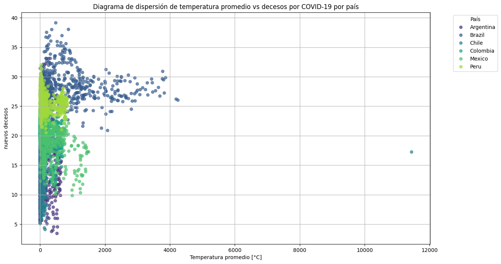

Conclusiones del Análisis Comparativo:

#### Relación entre Temperatura Promedio y Nuevos Casos Confirmados:

- El gráfico sugiere una correlación entre la temperatura promedio y el aumento de casos de COVID-19 en países con climas cálidos.
- Sin embargo, no se puede establecer una relación causal debido a la influencia de otros factores como la densidad poblacional, comportamientos sociales y capacidad de testeo.
- Un análisis más profundo es necesario para determinar la causalidad.

#### Relación entre Temperatura Promedio y Nuevos Decesos:

- De manera similar, el gráfico muestra una posible correlación entre la temperatura promedio y el número de decesos por COVID-19 en países cálidos.
- Factores adicionales como la prevalencia de enfermedades crónicas, la calidad de la atención médica y los efectos indirectos del calor pueden influir en los resultados observados.
- Al igual que en el análisis de los casos confirmados, se requiere un análisis más profundo para establecer cualquier causalidad.

#### Consideraciones y Medidas Preventivas:

- La temperatura debe ser considerada como un posible factor de riesgo para el COVID-19 en países con climas cálidos.
- Es crucial tomar medidas preventivas en estas regiones, como el distanciamiento social, el uso de máscaras y la ventilación adecuada.
- Para reducir la mortalidad, es importante la vacunación de grupos vulnerables, la mejora del acceso a atención médica y la implementación de campañas de salud pública sobre los riesgos asociados al calor.

### Promedio Mensual de Dosis de Vacunación Administradas por País en Latinoamérica

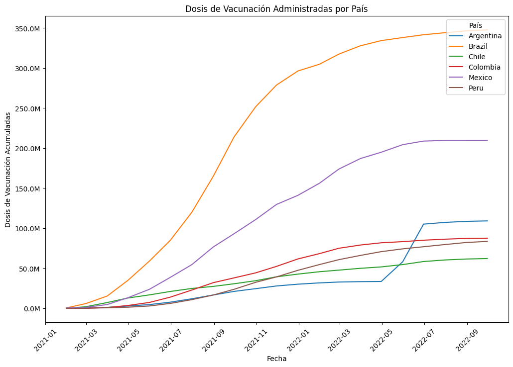

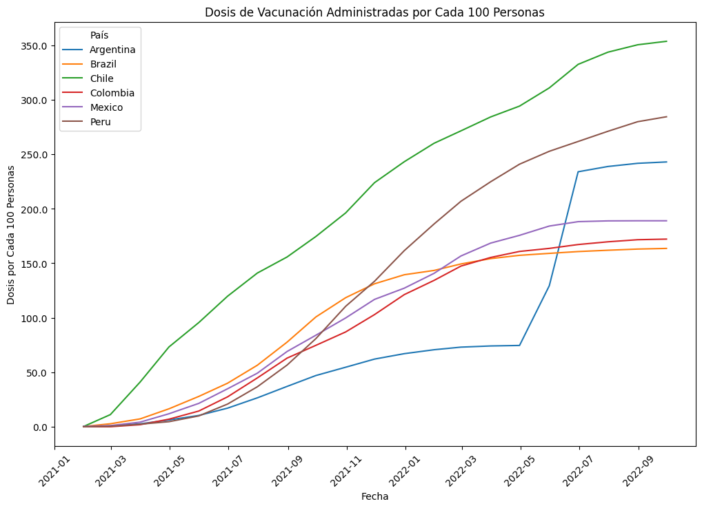

Los dos gráficos analizados, "Dosis de Vacunación Administradas por País" y "Dosis de Vacunación Administradas por Cada 100 Personas", proporcionan información complementaria sobre la vacunación contra el COVID-19 en Latinoamérica.

En el primer gráfico, Brasil se destaca como el país con mayor cantidad de dosis administradas en total.

Sin embargo, cuando se analiza la cantidad de dosis administradas por cada 100 personas, Brasil se ubica en una posición intermedia, superado por países como Chile, Perú y Argentina.

Esta aparente contradicción se explica por el tamaño de la población de Brasil.

Al tener una población mucho más grande que los demás países latinoamericanos, Brasil necesita administrar una mayor cantidad de dosis para alcanzar el mismo nivel de cobertura por cada 100 personas.

En general, los dos gráficos muestran que la distribución de vacunas contra el COVID-19 en Latinoamérica ha sido desigual.

Si bien Brasil ha administrado la mayor cantidad de dosis en total, su eficiencia en términos de dosis por cada 100 personas es menor que la de otros países como Chile, Perú y Argentina.

Esta desigualdad en la distribución de vacunas podría tener un impacto en el control de la pandemia en la región.

### Evolución Semanal de Casos Nuevos de COVID-19 en Países de Latinoamérica

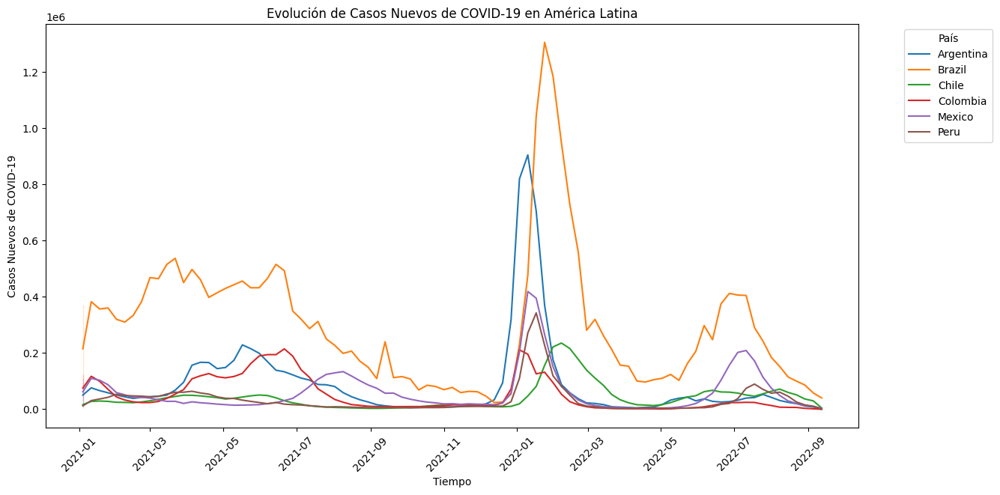

El gráfico muestra una tendencia dinámica en la evolución de nuevos casos de COVID-19 en Latinoamérica, con distintas etapas que reflejan el impacto de las medidas de control y la vacunación.

1. Fase inicial (2020):
Se observa un aumento exponencial en el número de casos, evidenciando la rápida propagación del virus en la región.
La implementación de medidas de restricción y distanciamiento social durante este período contribuyó a detener el crecimiento exponencial y evitar el colapso de los sistemas de salud.

2. Fase de descenso (finales de 2020 y principios de 2021):
Se observa una disminución en el número de casos como consecuencia de las medidas de control y el inicio de la vacunación.
La vacunación se convierte en un factor clave para controlar la pandemia y proteger a la población, especialmente a los grupos de mayor riesgo.

3. Rebote de casos (primer semestre de 2022):
Se observa un nuevo aumento en el número de casos, coincidiendo con el levantamiento de las restricciones en muchos países.
Este rebote podría atribuirse a la relajación de las medidas de control, la aparición de nuevas variantes del virus y la fatiga social con respecto a las medidas de prevención.
Brasil se destaca como el país más afectado durante este período, evidenciando la importancia de mantener medidas de control y vacunación adecuadas, incluso en etapas avanzadas de la pandemia.

4. segundo semestre de 2022:
Se observa una nueva tendencia a la baja en el número de casos, sugiriendo un posible control de la ola de rebrotes.
La vacunación continua y la aplicación de medidas de control focalizadas podrían estar contribuyendo a esta tendencia.
En general, el gráfico proporciona información valiosa sobre la dinámica de la pandemia en Latinoamérica y permite identificar patrones y tendencias que pueden ser útiles para guiar las estrategias de salud pública.

Es importante destacar que la evolución de la pandemia puede verse afectada por diversos factores, como la aparición de nuevas variantes, la efectividad de las vacunas y el comportamiento social.

### Evolución de decesoss de COVID-19 en América Latina

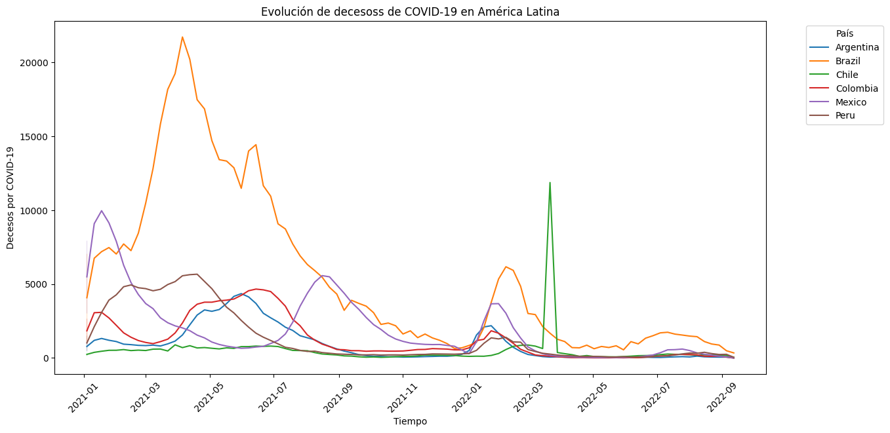

El gráfico muestra una tendencia similar a la de nuevos casos, con un aumento inicial, una fase de descenso y un posterior rebote en los decesos por COVID-19 en Latinoamérica.

1. Fase inicial (2020):
Se observa un aumento exponencial en el número de muertes, reflejando el impacto severo de la pandemia en la región.
La falta de preparación de los sistemas de salud y la alta letalidad del virus contribuyeron a la elevada tasa de mortalidad durante este período.

2. Fase de descenso (finales de 2020 y principios de 2021):
Se observa una disminución en el número de muertes como consecuencia de las medidas de control y el inicio de la vacunación.
La vacunación fue un factor clave para proteger a los grupos de mayor riesgo y reducir la tasa de mortalidad.

3. Rebote de decesos (primer semestre de 2022):
Se observa un nuevo aumento en el número de muertes, coincidiendo con el levantamiento de las restricciones en muchos países.
Este rebote podría atribuirse a las mismas causas que el aumento de casos: relajación de medidas, nuevas variantes y fatiga social.
Aunque el repunte no fue tan pronunciado como al inicio de la pandemia, los valores de decesos se mantuvieron altos en comparación con períodos anteriores.

4. segundo semestre de 2022:
Se observa una nueva tendencia a la baja en el número de muertes, sugiriendo un posible control de la ola de rebrotes.
La vacunación continua y la aplicación de medidas de control focalizadas podrían estar contribuyendo a esta tendencia.
En general, el gráfico proporciona información valiosa sobre la relación entre las medidas de control y la tasa de mortalidad por COVID-19 en Latinoamérica.

### Población por Grupo Etario y País en América Latina

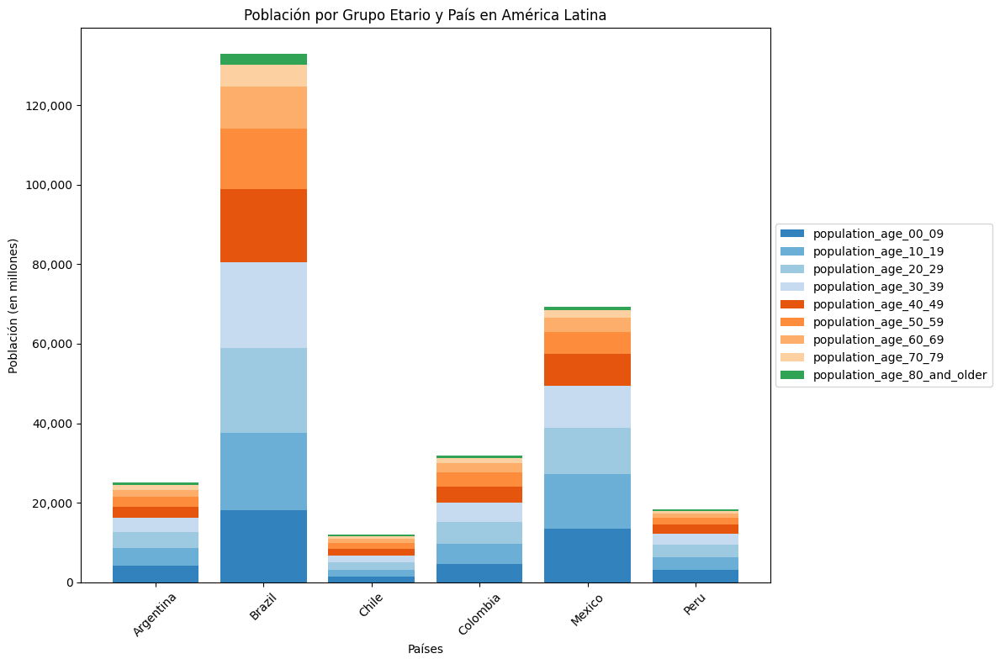

El gráfico muestra una distribución de la población afectada por COVID-19 en Latinoamérica por grupo etario, revelando que todos los grupos han sido impactados por la pandemia en diferentes proporciones.

Si bien no se observa una afectación uniforme en todos los grupos etarios, es importante destacar que:

Los grupos de mayor edad (60 años y más) presentan una mayor tasa de mortalidad por COVID-19, debido a su mayor susceptibilidad a las complicaciones graves de la enfermedad.
Los grupos de edad intermedia (40-59 años) también se han visto afectados significativamente, tanto por la enfermedad en sí como por las medidas de control de la pandemia.
Los grupos más jóvenes (0-39 años) han presentado una menor tasa de mortalidad, pero no han sido inmunes al virus y han podido experimentar síntomas leves o graves, además de verse afectados por las medidas de control.
Es importante considerar que la distribución de la población afectada por COVID-19 puede variar entre países e incluso dentro de cada país, debido a diversos factores como:

Estructura poblacional: La proporción de personas en cada grupo etario puede variar entre países.
Comorbilidades: La prevalencia de enfermedades preexistentes, como diabetes, enfermedades cardíacas y enfermedades respiratorias, puede influir en la susceptibilidad al virus y la gravedad de la enfermedad.
Acceso a la atención médica: La calidad y disponibilidad de los servicios de salud pueden afectar el diagnóstico, tratamiento y pronóstico de la enfermedad.
Medidas de control: La implementación y efectividad de las medidas de control de la pandemia, como el distanciamiento social, el uso de máscaras y la vacunación, pueden influir en la transmisión del virus y la protección de diferentes grupos poblacionales.
En general, el gráfico proporciona información valiosa sobre la distribución de la población afectada por COVID-19 en Latinoamérica.

### Personal de Salud por País

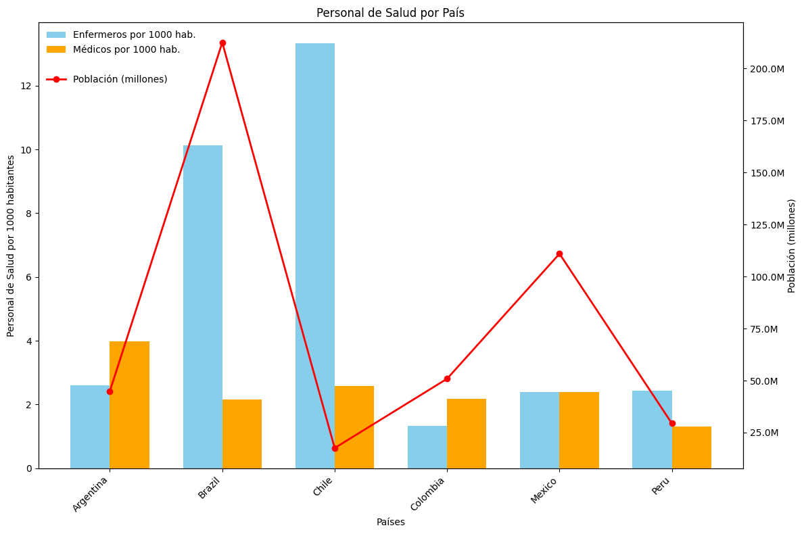

El gráfico que muestra la relación entre el personal de salud y la población en Latinoamérica revela una distribución desigual de recursos humanos en el sector sanitario de la región.

Se observa que:

Brasil, Chile y Argentina presentan una mayor cantidad de personal de salud por cada 1000 habitantes, lo que podría indicar una mejor capacidad para atender las necesidades de salud de su población.
Perú, México y Colombia tienen una menor cantidad de personal de salud por cada 1000 habitantes, lo que podría sugerir una potencial sobrecarga en el sistema sanitario y dificultades para brindar una atención adecuada a toda la población.
La población de cada país varía considerablemente, lo que implica que la cantidad total de personal de salud también es muy diferente entre los países. Brasil, por ejemplo, tiene la población más grande de la región y, en consecuencia, la mayor cantidad total de personal de salud.
Es importante considerar que la cantidad de personal de salud no es el único factor que determina la calidad de la atención médica.

Otros factores relevantes incluyen:

La distribución del personal de salud: Un país puede tener una cantidad adecuada de personal de salud en general, pero si este personal no está distribuido de manera equitativa en todo el territorio, algunas áreas podrían enfrentar escasez.
La calidad de la formación del personal de salud: Un país puede tener una gran cantidad de personal de salud, pero si la calidad de su formación no es adecuada, la atención médica podría no ser óptima.
La disponibilidad de recursos e infraestructura: Un país puede tener una cantidad adecuada de personal de salud bien capacitado, pero si no cuenta con los recursos e infraestructura necesarios para que puedan trabajar de manera eficiente, la calidad de la atención médica se verá afectada.
En general, el gráfico proporciona información valiosa sobre la distribución del personal de salud en relación con la población en Latinoamérica.

### Dosis per cápita de vacunas administradas por País

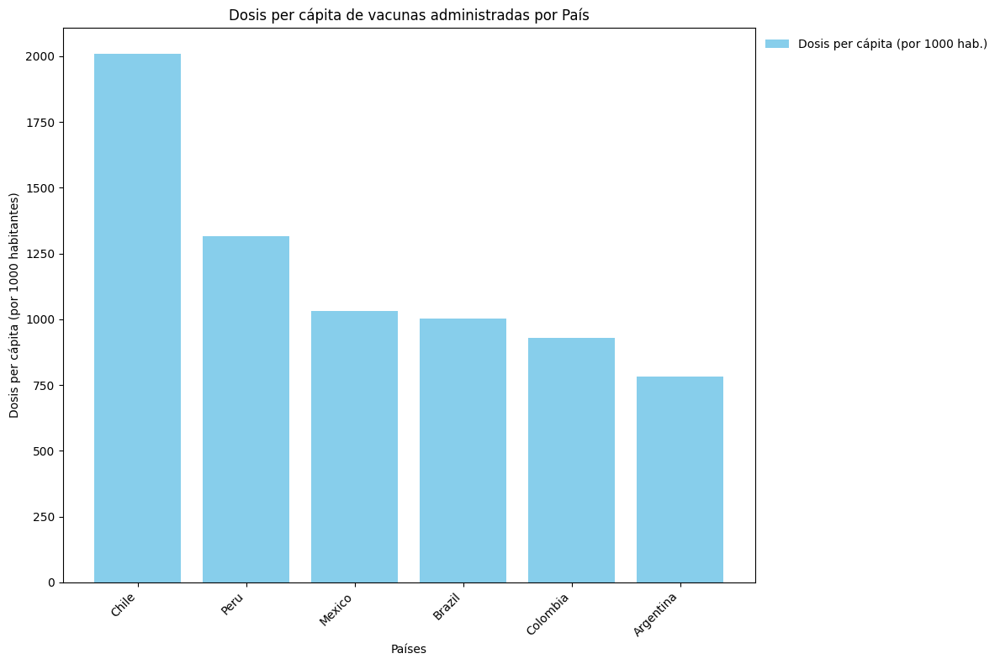

El gráfico muestra una distribución desigual en la administración de dosis de vacunas contra el COVID-19 entre los países latinoamericanos.

Brasil se destaca como el país con mayor cantidad de dosis administradas en total, seguido de Argentina, Chile, Colombia, México y Perú.

Sin embargo, cuando se analiza la cantidad de dosis administradas por cada 1000 habitantes, Brasil se ubica en una posición intermedia, superado por países como Chile, Perú y Argentina.

Esta aparente contradicción se explica por el tamaño de la población de Brasil.

Al tener una población mucho más grande que los demás países latinoamericanos, Brasil necesita administrar una mayor cantidad de dosis para alcanzar el mismo nivel de cobertura por cada 1000 habitantes.

En general, los dos gráficos muestran que la distribución de vacunas contra el COVID-19 en Latinoamérica ha sido desigual.

Si bien Brasil ha administrado la mayor cantidad de dosis en total, su eficiencia en términos de dosis por cada 1000 habitantes es menor que la de otros países como Chile, Perú y Argentina.

Esta desigualdad en la distribución de vacunas podría tener un impacto en el control de la pandemia en la región.

### GDP y GDP per Capita por País

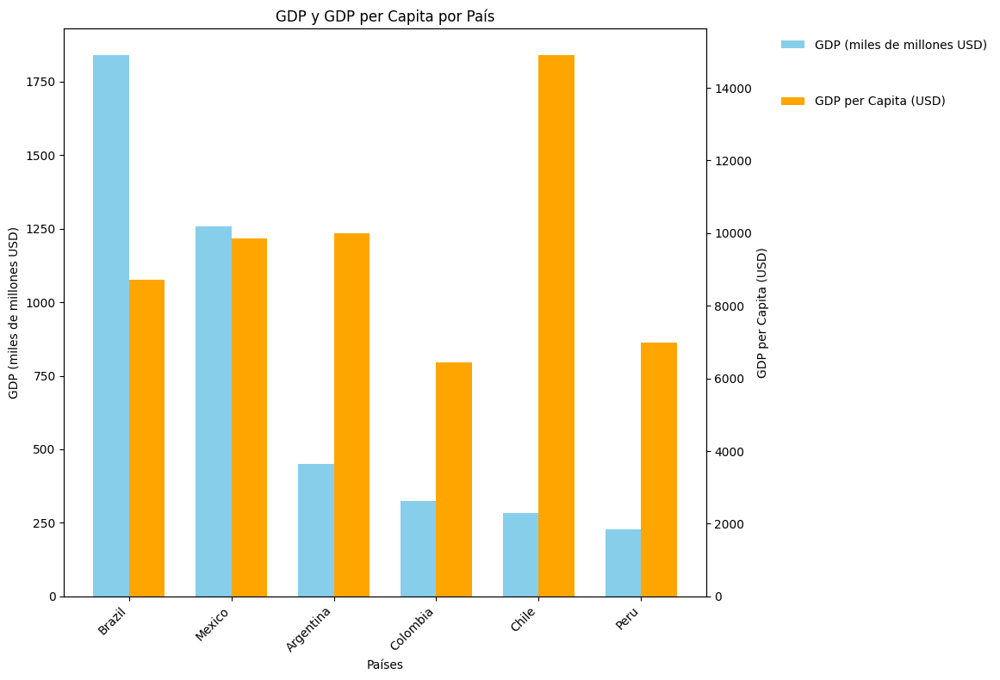

El gráfico muestra una relación compleja entre la capacidad económica (PIB y PIB per cápita) y la respuesta al COVID-19 en Latinoamérica.

Se observan algunas tendencias generales:

Los países con mayor capacidad económica (Brasil y Argentina) también presentan una mayor cantidad de casos confirmados de COVID-19 por cada 1000 habitantes.
Los países con menor capacidad económica (Perú y Colombia) presentan una menor cantidad de casos confirmados de COVID-19 por cada 1000 habitantes.
Sin embargo, existen excepciones a estas tendencias:

Chile, con una capacidad económica intermedia, tiene una de las mayores cantidades de casos confirmados de COVID-19 por cada 1000 habitantes.
México, con una capacidad económica intermedia, tiene una de las menores cantidades de casos confirmados de COVID-19 por cada 1000 habitantes.
Es importante considerar que la cantidad de casos confirmados de COVID-19 puede verse afectada por diversos factores, como la cantidad de pruebas realizadas, la calidad de los sistemas de vigilancia epidemiológica y las medidas de control de la pandemia.

Además, es importante tener en cuenta que los datos del gráfico pueden no estar completamente actualizados o completos.

En general, el gráfico proporciona información valiosa sobre la relación entre la capacidad económica y la respuesta al COVID-19 en Latinoamérica.

Sin embargo, es necesario un análisis más profundo que considere los factores mencionados anteriormente para comprender mejor las causas de esta relación y para diseñar estrategias de salud pública efectivas para controlar la pandemia en la región.

### Prevalencia de fumadores y diabetes por País

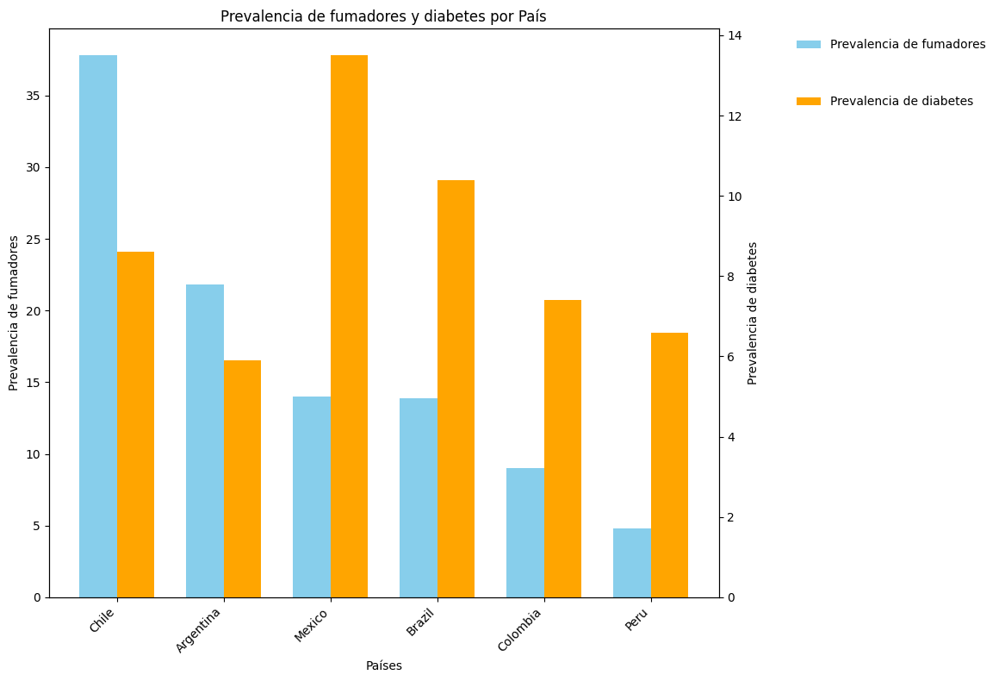

El análisis de los gráficos y la información proporcionada permite concluir que el tabaquismo, la diabetes y el COVID-19 están estrechamente relacionados y han tenido un impacto significativo en la salud de la población latinoamericana.

A continuación, se resumen los puntos clave de esta relación:

Relación entre el tabaquismo y la diabetes:

El tabaquismo es un factor de riesgo importante para desarrollar diabetes tipo 2.
Fumar aumenta la resistencia a la insulina y daña las células del páncreas que producen insulina.
Las personas que fuman tienen un mayor riesgo de sufrir complicaciones de la diabetes, como enfermedades cardíacas, accidentes cerebrovasculares, enfermedades renales y ceguera.
Relación entre la diabetes y el COVID-19:

Las personas con diabetes tienen un mayor riesgo de desarrollar COVID-19 grave.
La diabetes debilita el sistema inmunológico y aumenta la inflamación, lo que hace que las personas sean más susceptibles a las infecciones y a las complicaciones graves del COVID-19.
Las personas con diabetes que contraen COVID-19 tienen un mayor riesgo de hospitalización, ingreso en la UCI y muerte.
Impacto de la pandemia de COVID-19 en el tabaquismo y la diabetes:

La pandemia ha tenido un impacto negativo en los esfuerzos para prevenir y controlar el tabaquismo y la diabetes.
Las interrupciones en los servicios de salud y el distanciamiento social han dificultado el acceso a la atención y el apoyo para las personas con estas condiciones.

### Tasas de Mortalidad por País

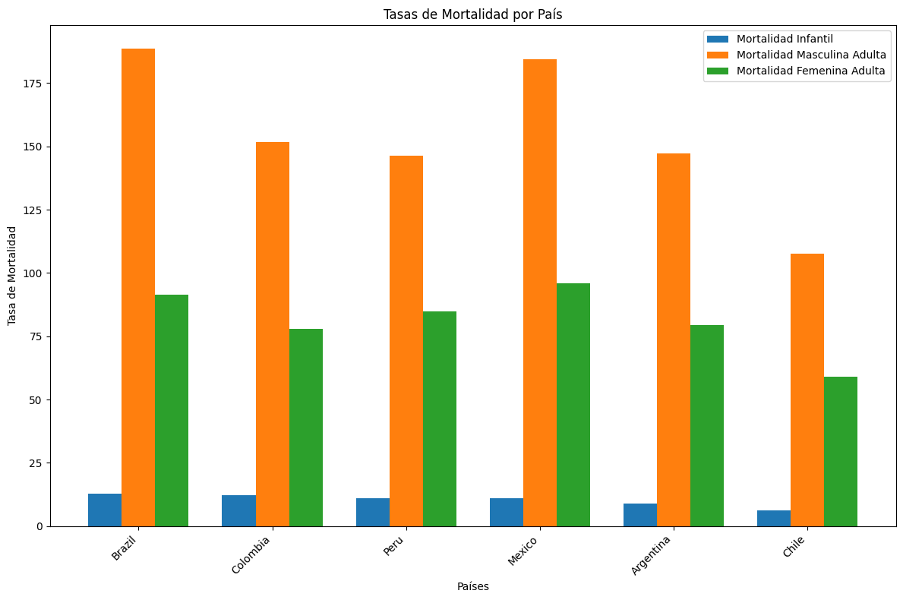

El gráfico muestra una variación significativa en las tasas de mortalidad infantil, masculina adulta y femenina adulta por COVID-19 en diferentes países de Latinoamérica.

Se observan algunas tendencias generales:

Los países con mayor tasa de mortalidad infantil por COVID-19 (Brasil y Perú) también tienen una tasa de mortalidad masculina adulta y femenina adulta relativamente alta.
Los países con menor tasa de mortalidad infantil por COVID-19 (México y Argentina) también tienen una tasa de mortalidad masculina adulta y femenina adulta relativamente baja.
Sin embargo, existen excepciones a estas tendencias:

Colombia tiene una tasa de mortalidad infantil por COVID-19 similar a la de Brasil y Perú, pero una tasa de mortalidad masculina adulta y femenina adulta significativamente más baja.
Chile tiene una tasa de mortalidad infantil por COVID-19 similar a la de México y Argentina, pero una tasa de mortalidad masculina adulta significativamente más alta.
Es importante considerar que las tasas de mortalidad por COVID-19 pueden verse afectadas por diversos factores, como la edad de la población, la prevalencia de comorbilidades, la calidad de la atención médica, las medidas de control de la pandemia y la cobertura de vacunación.

En general, el gráfico proporciona información valiosa sobre las variaciones en las tasas de mortalidad por COVID-19 en Latinoamérica.

Sin embargo, es necesario un análisis más profundo que considere los factores mencionados anteriormente para comprender mejor las causas de estas variaciones y para diseñar estrategias de salud pública efectivas para reducir la mortalidad por COVID-19 en la región.
