

  

# Informe: Impacto del COVID-19 en América Latina

## Introducción
---

La pandemia de COVID-19 tuvo un impacto profundo y multifacético en todo el mundo, y los países de Latinoamérica no fueron la excepción. Esta región, caracterizada por su diversidad demográfica, socioeconómica y de infraestructura de salud, experimentó una variedad de respuestas y resultados ante la crisis sanitaria. El presente estudio se centra en analizar y comprender cómo el COVID-19 afectó a diferentes países de Latinoamérica, proporcionando una visión integral basada en datos.

## Metodología de trabajo
---

Para analizar el impacto del COVID-19 en los países de Latinoamérica, seguimos una metodología estructurada que incluye las siguientes etapas:

- **Extracción de Datos:** fuentes confiables sobre casos, muertes, vacunación, indicadores socioeconómicos y demográficos.
- **Transformación de Datos:** limpieza, normalización y estandarización.
- **Identificación de Anomalías:** detección y corrección de outliers, validación cruzada.
- **Preparación del Conjunto de Datos:** integración y creación de variables derivadas.
- **Análisis Exploratorio (EDA):** visualizaciones, estadísticas descriptivas, correlaciones.
- **Interpretación y Conclusiones:** insights para mejorar la respuesta ante futuras pandemias.

## Análisis Exploratorio de Datos
---

### Matriz de Correlación de Variables

  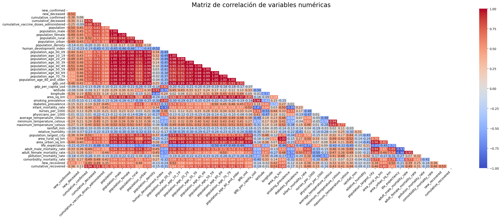

Principales hallazgos:

- Mayor mortalidad en hombres.
- Alta relación entre comorbilidades y mortalidad.
- La vacunación reduce contagios.
- Mayor densidad poblacional = más casos.
- PIB per cápita no influye en contagios, pero sí en mortalidad.

> *Las correlaciones no implican causalidad directa.*

---

### Casos Confirmados Acumulados por País

  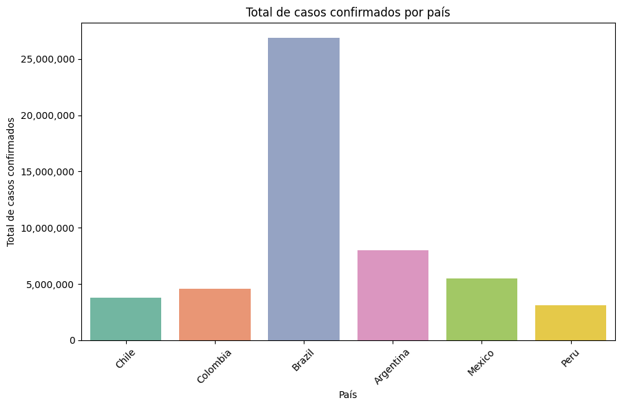

- Brasil lidera en casos confirmados.
- Factores: tamaño y densidad poblacional, medidas de control, testeo.

---

### Temperatura Promedio vs Casos y Decesos

  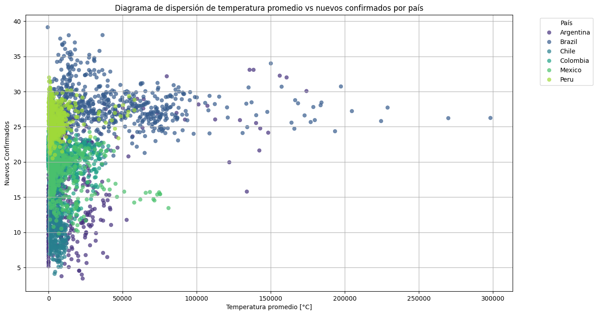

  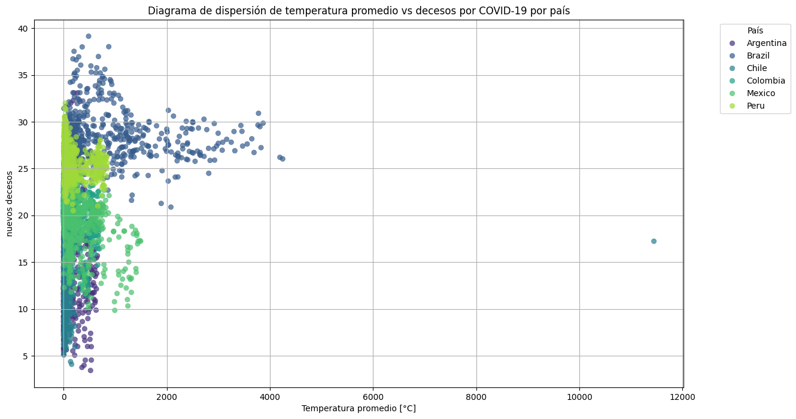

- Posible correlación en climas cálidos.
- Se necesitan estudios más profundos.

---

### Dosis de Vacunación Administradas

  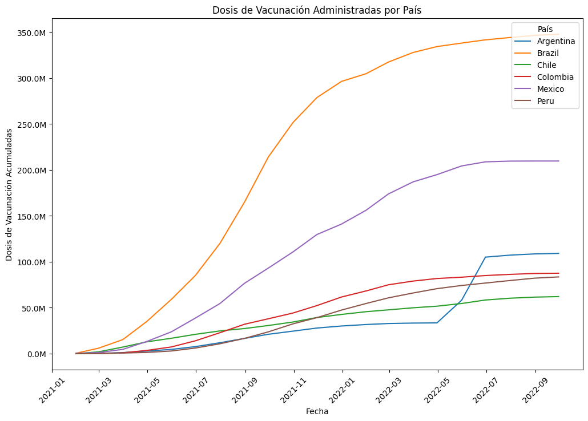

  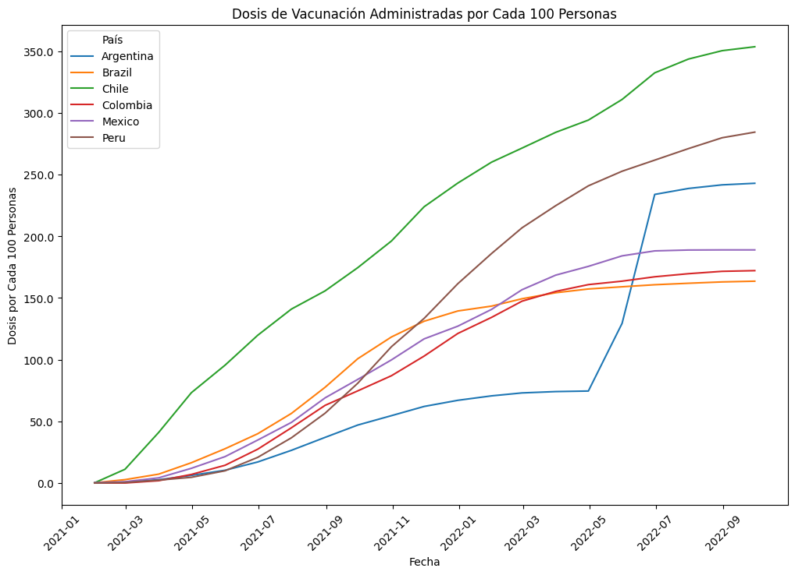

- Brasil administra más dosis totales, pero Chile, Perú y Argentina destacan en cobertura proporcional.

---

### Evolución de Casos Nuevos Semanales

  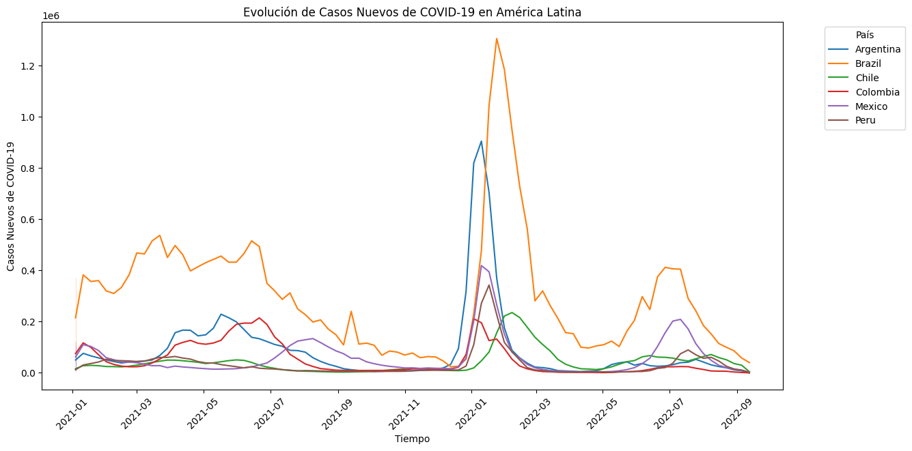

Fases identificadas:
1. Aumento inicial (2020).
2. Descenso por vacunación (2021).
3. Rebrote tras reaperturas (2022).
4. Nueva baja (2do semestre 2022).

---

### Evolución de Decesos

  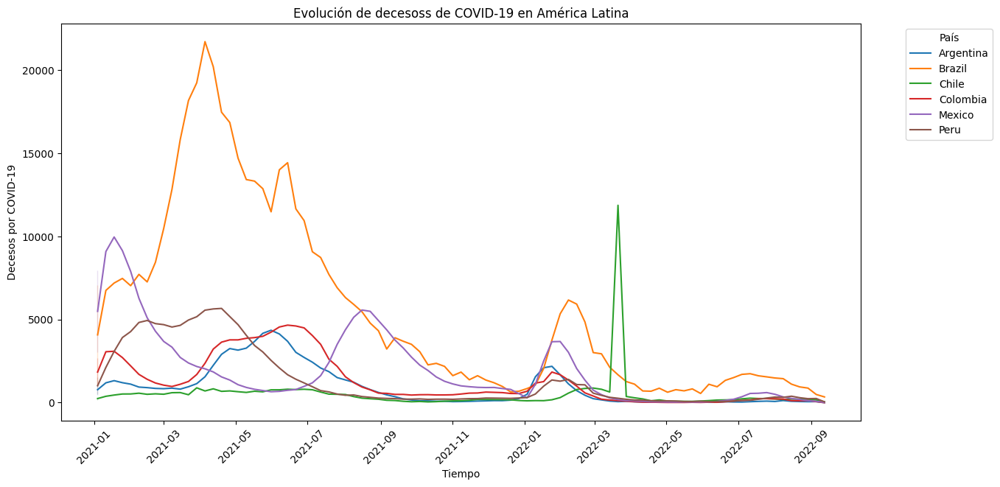

- Patrón similar al de casos nuevos.
- Importancia de sistemas de salud y vacunación.

---

### Población por Grupo Etario

  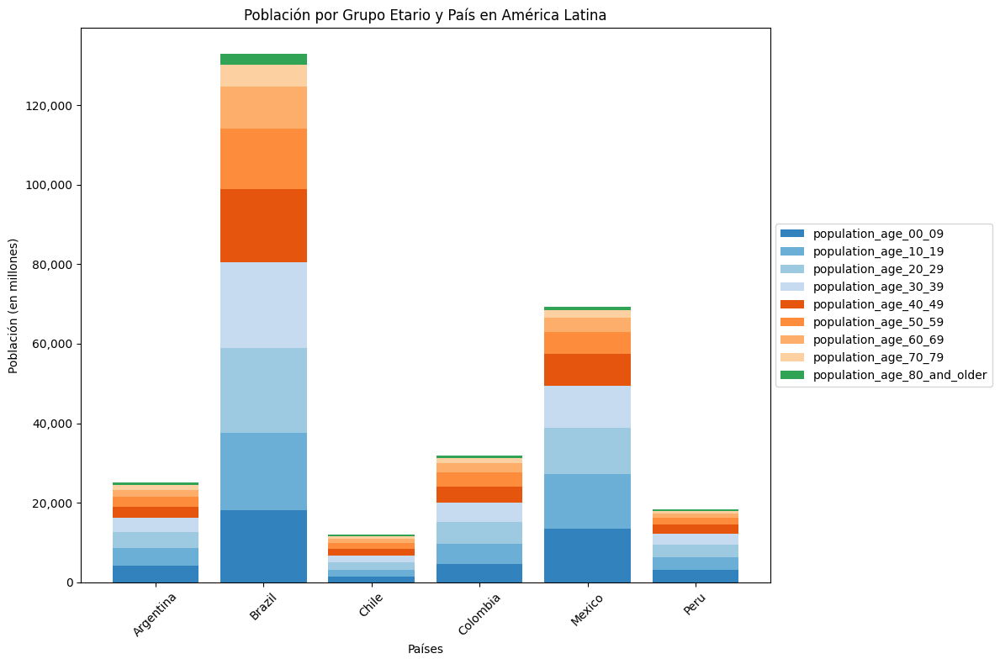

- Mayores de 60: mayor mortalidad.
- Jóvenes: menos letalidad, pero impacto indirecto.

---

### Personal de Salud por País

  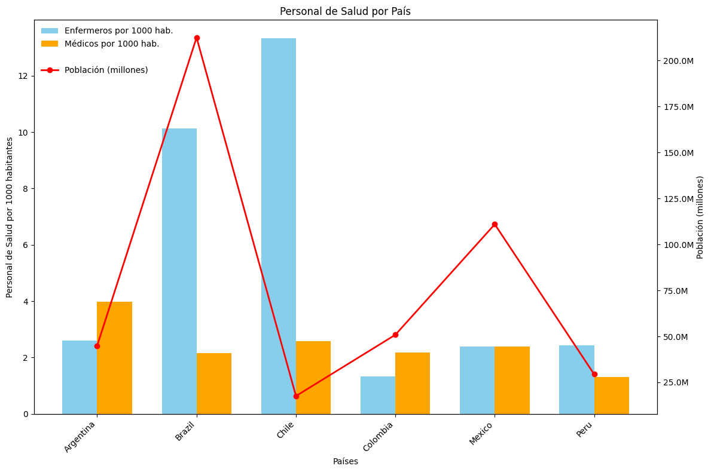

- Brasil, Chile y Argentina presentan mejor cobertura.
- Perú, México y Colombia: menor disponibilidad por habitante.

---

### Dosis de Vacunas per Cápita

  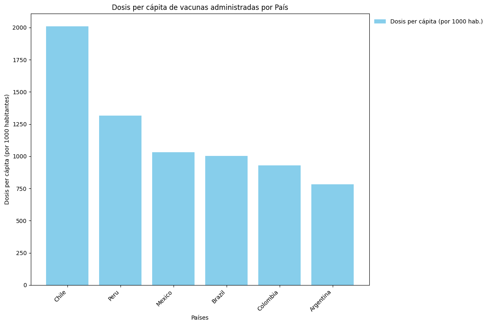

- Cobertura proporcional favorece a Chile y Perú.
- Brasil, pese a liderar en dosis totales, muestra cobertura media.

---

### PIB y PIB per Cápita

  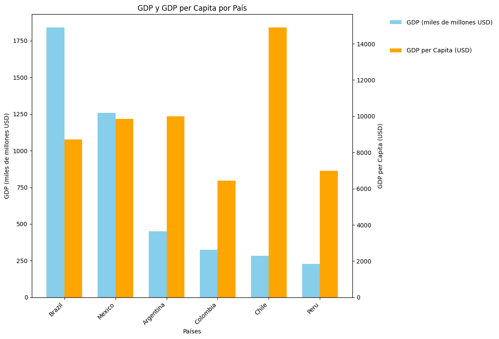

- Relación entre economía y tasa de casos no es directa.
- PIB per cápita influye más en capacidad de respuesta y mortalidad.

---

### Fumadores y Diabetes

  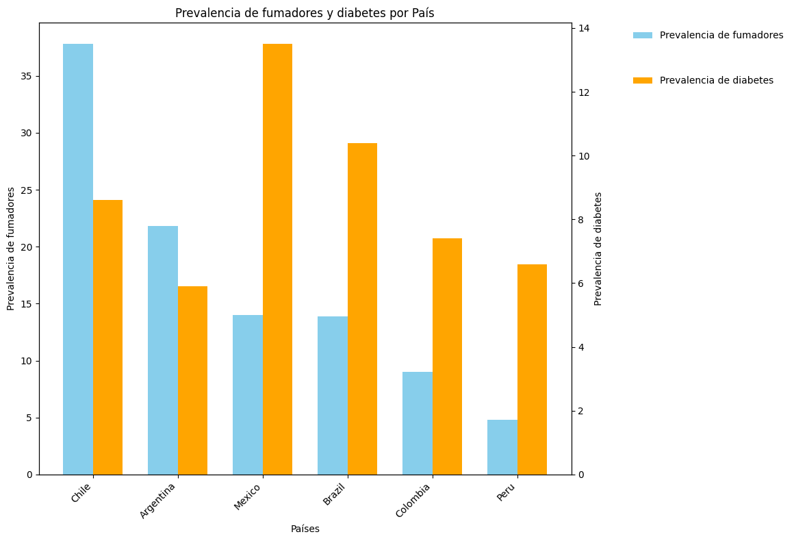

- Fumar y la diabetes aumentan el riesgo de COVID-19 grave.
- Comorbilidades agravan la situación sanitaria regional.

---

### Tasas de Mortalidad por País

  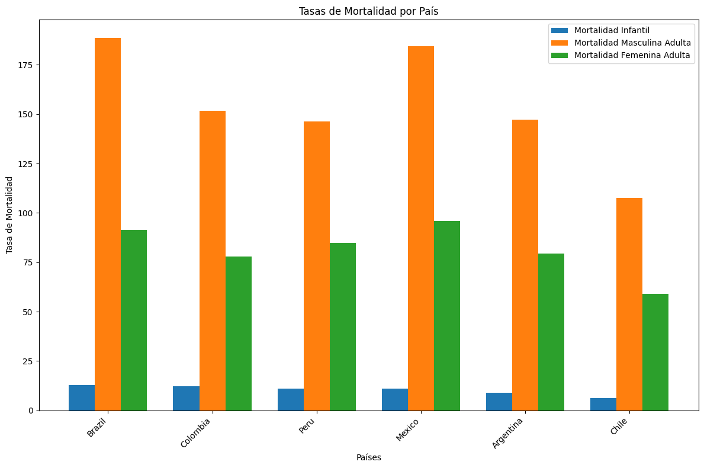

- Altas tasas en Brasil y Perú.
- México y Argentina presentan tasas más bajas.
- Excepciones como Colombia y Chile invitan a análisis más profundo.

---

## Conclusiones
---

La pandemia de COVID-19 ha impactado de manera desigual a los países de Latinoamérica. Algunas conclusiones clave:

- **Mortalidad:** Hombres y personas mayores con comorbilidades presentan mayor riesgo.
- **Vacunación:** Factor clave en reducción de contagios y muertes.
- **Economía:** PIB per cápita influye en capacidad de respuesta, no tanto en cantidad de casos.
- **Disparidades regionales:** Factores como testeo, infraestructura de salud, distribución de personal y medidas adoptadas explican las diferencias.

> Es fundamental continuar analizando estos datos para mejorar la preparación ante futuras emergencias sanitarias en la región.
